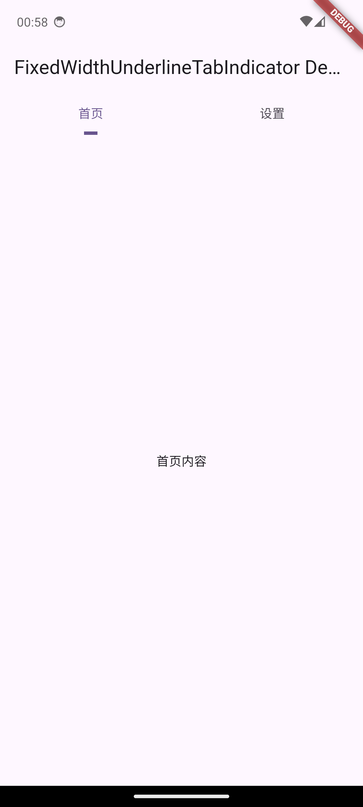

# Fixed Width Underline Tab Indicator 固定宽度下划线指示器

A drop-in `TabBar` indicator that keeps the underline width constant so every label looks equally emphasized.
一个保持下划线固定宽度的 `TabBar` 指示器，确保不同长度的标签获得一致的视觉权重。



## Features | 功能特性
- **Consistent width / 固定宽度**: Underline stays the same length no matter how long the tab text is.
- **TabBar ready / 原生适配**: Works with any `TabBar` + `TabBarView` without extra boilerplate.
- **Insets aware / 支持边距**: Honors custom `EdgeInsets` and text direction (LTR / RTL)。
- **Lightweight / 轻量化**: Implemented as a single `Decoration` class with zero dependencies。

## Getting Started | 快速开始
Add the dependency / 在 `pubspec.yaml` 中添加依赖：

```yaml
dependencies:
  fixed_width_underline_tab_indicator: ^1.0.0
```

Import the package / 引入库文件：

```dart
import 'package:fixed_width_underline_tab_indicator/fixed_width_underline_tab_indicator.dart';
```

## Usage | 使用示例
Wrap your tabs in a `DefaultTabController` and set the indicator / 在 `DefaultTabController` 中使用该指示器：

```dart
DefaultTabController(
  length: 3,
  child: Scaffold(
    appBar: AppBar(
      bottom: TabBar(
        indicator: const FixedWidthUnderlineTabIndicator(
          width: 24,
          borderSide: BorderSide(color: Colors.white, width: 3),
          insets: EdgeInsets.symmetric(horizontal: 16),
        ),
        tabs: const [
          Tab(text: 'Home'),
          Tab(text: 'Explore'),
          Tab(text: 'Profile'),
        ],
      ),
    ),
    body: const TabBarView(
      children: [
        Center(child: Text('Home')),
        Center(child: Text('Explore')),
        Center(child: Text('Profile')),
      ],
    ),
  ),
);
```

## Additional Information | 更多信息
- Explore `example/` for a runnable demo / 运行 `example/` 示例项目了解完整用法。
- File issues or feature requests in the repo / 在仓库中提交问题或功能需求。
- Pair with assets under `doc/` when publishing / 发布到 pub.dev 时可搭配 `doc/` 下的截图提升展示效果。
